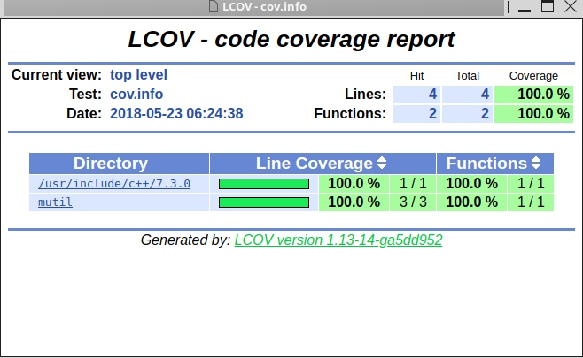

# ccov 
personal util for c/c++ coverage using clion + cmake + llvm-cov 

## step 1 
Add to `CMKaeLists.txt`, build and test.

```cmake
set(CMAKE_CXX_FLAGS "-g -O0 -Wall -fprofile-arcs -ftest-coverage")
set(CMAKE_CXX_OUTPUT_EXTENSION_REPLACE 1)
```

## step 2

Run ccov in project directory, using google chrome , will display results 
`ccov -p [Project Name]`, `-p` flag not required if same name as `pwd`.
Have `google-chrome` in you path to see llcov report



---

# lic 
(c)2018 Titus T. MIT
